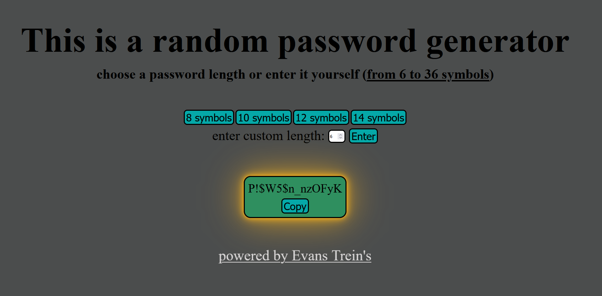

Language: [EN](https://github.com/EvansTrein/generate-random-password-go/blob/main/README.md), [RU](https://github.com/EvansTrein/generate-random-password-go/blob/main/README_RU.md)

# Random password generator
Allows generating passwords of different lengths (the length can be set manually).

# Why and how I did it
There was a desire to realize the interaction of frontend and backend, but at the same time, the application itself should be minimalistic (intentionally did not want to complicate the task).

Now specifically:

* The interplay of frontend and backend. This was my **main goal**, I wanted to implement functionality where something is clicked in the browser - logic happens - result is returned and the browser displays it. 

* Learn HTML/CSS + JavaScript base, as I understand, a good backend developer should know it. HTML and CSS - I managed to learn the base, JavaScript... not very well, I got more than *JavaScript for a layout designer* and that's the minimum. But I was convinced that frontend development is not my thing, to make beautiful and at the same time adaptive for all devices, cross-browser, etc. - is not my thing. 

* No problems with Go, Go is great! A simple web-server is written, there is an upload of static files to the server. Separately, learnt how to do dynamic routing (`github.com/gorilla/mux`). And there was work with importing Go packages + creating a directory for my project (working with file paths).

* All of this had to be packaged in Docker. Packed it. I learnt how to create an image + create a Dockerfile, launch a container (based on the image), save the image on the local machine, clean the Docker cache. In general - I learnt the basics. Since the project is minimal, I didn't use Docker Compose. Separately I would like to mention *multistage build*, at the first builds of images, their weight was about 2 GB (I inherited from Go language), I didn't like the weight and found a solution. Go is a compiled language, it needs a binary file and an environment where it will run, initially I didn't realise that storing the language itself to run the application is not necessary, only the binary file itself is needed. Then I found out about alpine and rebuilt Dockerfile, I had difficulties with understanding the paths in the directory (where to take from and where to copy to) + the first time, during multi-stage build, I didn't realise to put the static folder, as a consequence when launching such a container the program didn't find HTML/CSS templates and nothing was displayed, but then I solved this problem too. Now the image weighs 21.9 MB (10 times less!). 

# How to run
You can clone the repository - download the dependencies `go mod download` - open the project and in terminal write `go run main.go`, you must have Go language installed. The project will run on port 8800. Type in the url address `http://localhost:8800` in your browser.

Or download the docker image (the file is *random_password_image_docker*). The command to load the image from your computer into Docker is `docker load -i path_to_file_in_your_system`. 
