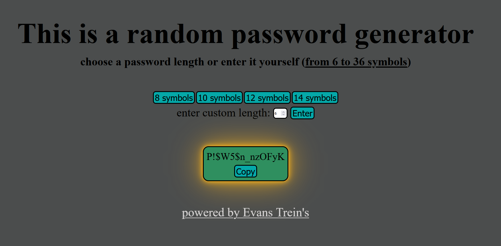

Language: [EN](https://github.com/EvansTrein/generate-random-password-go/blob/main/README.md), [RU](https://github.com/EvansTrein/generate-random-password-go/blob/main/README_RU.md)

# Генератор рандомных паролей
Позволяет генерировать пароли различной длины (длину можно задать вручную).

# Зачем и как сделал
Нужно было на практике разобраться с полным циклом (ну или почти полным) создания веб-приложения, но при этом, само приложение, должно было быть минималистичным (намеренно не хотел усложнять себе задачу). 

Теперь конкретно:

* Взаимодейсвтие frontend и backend. Это была **основная моя цель**, хотелось реализовать функционал, при котором в браузере что-то нажмут - произойдет логика - вернется результат и браузер это отобразит. 

* Изучить базу HTML/CSS + JavaScript, как я понял, хороший backend разрабочтик должен знать это. HTML и CSS - получилось нормально освоить базу, JavaScript... не очень вышло, получилось больше *JavaScript для верстальщика* и то минимум. Зато убедился, что frontend разработка это не мое, делать красиво и при этом адаптивно для всех устройств, кроссбраузерность и т.д. - не мое. 

* С Go проблем не было, Go замечательный! Написан простейший веб-сервер, есть выгрузка статичныйх файлов на сервер. Отдельно, научился делать динамическую маршрутизацию (`github.com/gorilla/mux`). И была работа с импортом пакетов Go + создание директории своего проекта (работа с путями файлов).

* Все это нужно было упаковать в Docker. Упаковал. Научился создавать образ + создавать Dockerfile, запускать контейнер (на основе образа), сохранять образ на локальной машине, чистить кеш Docker. В общем - базово изучил. Так как проект минимален - Docker Compose не использовал. Отдельно отмечу *многоступенчатую сборку*, при первых сборках образов, их вес был около 2 ГБ (я наследовался от языка Go), мне не нравился вес и я нашел решение. Go компилируемый язык, ему нужен бинарный файл и среда, где он будет запускаться, изначально я не понял, что хранить сам язык для работы приложения не нужно, нужен только сам бинарный файл. Тут узнал про alpine и пересобрал Dockerfile, были сложности с пониманием путей в директории (откуда брать и куда копировать) + первый раз, при многоступеначатой сборке, не догадался положить папку static, как следствие при запуске такого контейнера программа не нашла шаблоны HTML/CSS и ничего неотображалось, но потом и эту проблему решил. Теперь образ весит 21.9 МБ (в 10 раз меньше!). 

# Как запустить
Можете клонировать репозиторий - загрузить зависимости `go mod download` - открыть проект и в терминале написать `go run main.go`, при этом у вас должен быть установлен язык Go. Проект будет запущен на порте 8800. Вбейте в браузере url адрес `http://localhost:8800`.

Или скачайте образ docker (файл - *random_password_image_docker*). Команда для загрузки образа с вашего компьютера в Docker `docker load -i путь_к_файлу_в_вашей_системе`. 
